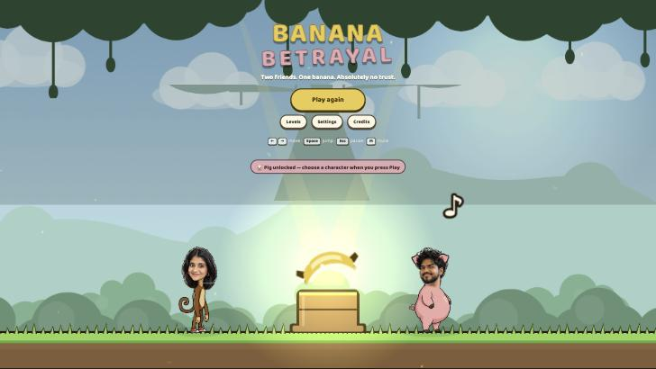
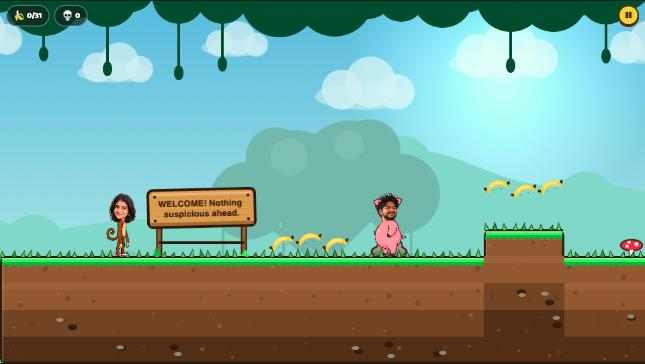
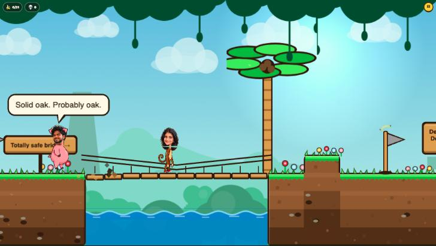
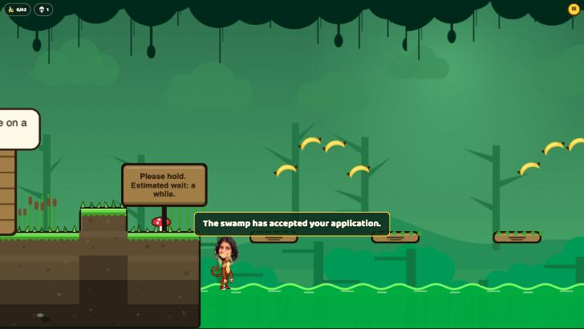
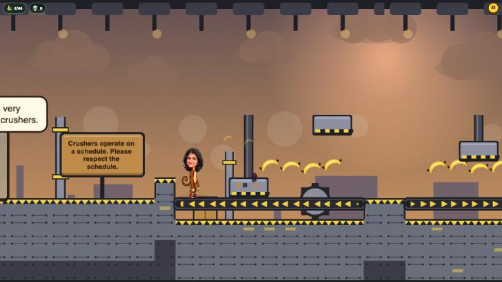
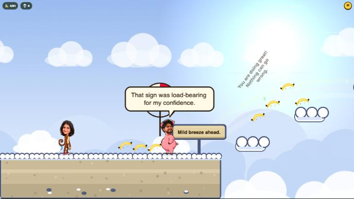
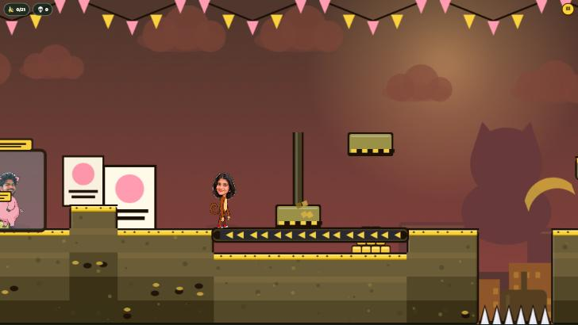
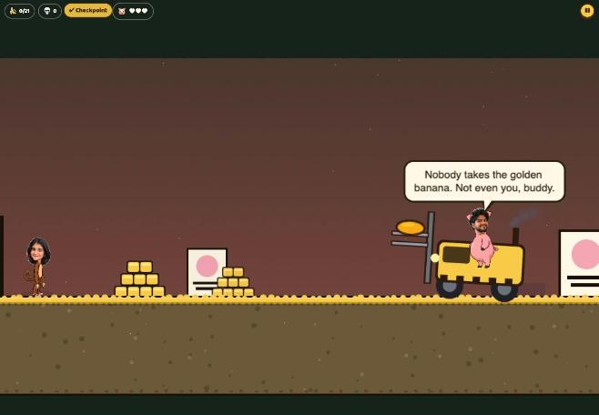
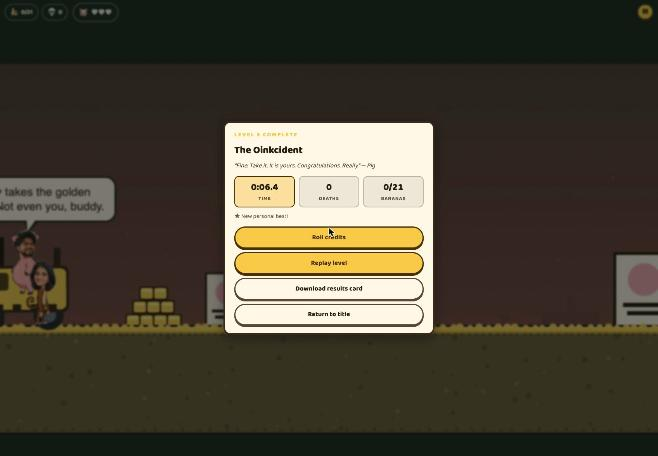

# Banana Betrayal

*Makad & Dukkar: He Started It.*

A comedy 2D platformer for the browser. Makad the monkey wants the legendary golden banana; Dukkar the pig, self-appointed
Chief of Mischief, claims to know the way. Every helpful suggestion makes the journey worse, and Makad gets steadily better at
making Dukkar regret it. Built with Phaser 4, TypeScript and Vite; ships as a static site.



| | |
|---|---|
|  |  |
|  |  |
|  |  |
|  |  |

Before/after captures of the art pass live in `docs/screenshots/before/` and `docs/screenshots/after/`.

## Play it locally

```bash
npm install
npm run dev        # http://localhost:5173
```

Production build and preview (what GitHub Pages serves):

```bash
npm run build      # typecheck + bundle into dist/
npm run preview    # serve dist/ at http://localhost:4173
```

## Controls

| Action | Keyboard | Touch | Gamepad |
|---|---|---|---|
| Move | A / D or ← / → | left pad | left stick / d-pad |
| Jump (hold for height) | Space, W or ↑ | JUMP | A / B |
| Bonk (short swing in front of Makad) | J or X | BONK | X |
| Talk / contextual action (prompt appears above Makad) | E or Enter | ! | Y |
| Pick a reply | 1 / 2 / 3, arrows + Enter | tap | – |
| Restart from checkpoint | R | pause menu | Select |
| Pause | Esc | ❚❚ button | Start |
| Mute | M | settings | – |
| Dev overlay | ` or F3 (dev builds) | – | – |

Touch controls appear automatically on coarse-pointer devices and can be forced on/off in Settings.

## Campaign

1. **Trust Issues** — a cheerful jungle with suspiciously confident signs.
2. **Customer Support Swamp** — sinking platforms, bubbles, mechanical crocodiles and a help desk.
3. **The Banana Economy** — conveyors, crushers, cargo, switches and a FREE BANANA machine (fees apply).
4. **Cloud Storage** — wind, crumbling clouds, falling anvils and a cloud that doubts itself.
5. **The Oinkcident** — everything at once, then Dukkar and his banana forklift.

Finishing the campaign unlocks Dukkar as a playable character. Every level can be replayed from the Levels menu
with a timer, personal bests and a ghost of your best run.

### Dukkar encounters (all optional)

Every level has a few staged gags with Dukkar. None of them is required to finish a level; most hand out a bonus
banana, some unlock a local achievement.

| Level | Where | What happens |
|---|---|---|
| 1 | Start (Dukkar at the welcome sign) | He is holding your banana. Bonk it loose, shout **DUKKAR!**, or Talk and pick a reply (explain / do it yourself / silent stare). |
| 1 | The three-tile pit | "It's literally one jump." Ask him to **Show me** and he demonstrates, badly; the correct arc is shown afterwards. |
| 1 | Past the coconut palm | The red button. Walk past it (achievement *Unbothered*) or press it yourself (confetti, GOTCHA). |
| 2 | Help desk | **Complain** at the Prank Complaint Department: printer, REFUND stamp, banana on his head. |
| 2 | The croc route | Dukkar's "shortcut": queue sign, tiny puddle, ladders to nowhere, "Time saved: questionable." Taking it earns a callback in level 4. |
| 2 | Escalations desk, Apology Kit | Same pig, taller box; an Official Apology Kit with a distant, unrelated explosion. |
| 3 | Supplies crate after checkpoint 1 | "Emergency supplies. Do not overthink it." |
| 3 | Before the FREE BANANA machine | He steals a bonus banana and runs; bonk it loose, or ignore him and he brings it back. |
| 4 | Start, checkpoint 1, mid island, end | "I know a—" callback; a tiny umbrella over the checkpoint; pull him out of his own net; another banana in hand. |
| 5 | Vault corridor | The coconut machine. Flip the direction sign before walking under the rail (achievement *Reverse Engineering*). |
| 5 | Boss | Phase lines, bolt-ons falling off, emergency light; after the fight: one safe bonk, the banner corrects itself, a handmade trophy and a choice of high-five / bonk / both. |

Seven achievements are stored locally in the save (`achievements` in save v2): Unbothered, Demonstration Required,
Complaint Escalated, Reverse Engineering, Banana Recovered, Dukkar Had It Coming, Brief Truce.

## Architecture

```
src/
  main.ts                 boot, Phaser config, render scale, global hotkeys
  scenes/                 Boot → Preload → Title → Game
  gameplay/
    player/               Player (physics + state machine) and CharacterRig (visual head/body layers)
    world/                Terrain baking, Backdrop parallax, Water, Decor, LevelWorld (object factory), SnapshotRegistry
    traps/                TrapStateMachine + every trap type (bridge, coconut, sinking, croc, crusher, clouds, machine…)
    objects/              Platforms, conveyor, bubbles, switches/gates, wind, hazards, checkpoints, flag, Dukkar NPC
    boss/                 PigBoss (three-phase forklift fight)
    ghost/                Ghost recorder/player (visual-only best-run replay)
    dialogue/             Speech bubbles and the rate-limited DialogueManager
    camera/               CameraController (look-ahead, dead-band, bounds, shake)
  core/                   input (keyboard/touch/gamepad), save (versioned schema + migrations), settings, audio (procedural), render scale
  ui/                     DOM overlays: HUD, pause, settings, results, level select, title menu, touch controls, captions
  levels/                 Level data (builder DSL), parser, validator, hash
  content/                ALL words: names, captions, Dukkar's lines, signs, credits  ← edit jokes here
  results/                Results card renderer (PNG download)
  dev/                    Dev overlay and browser test hooks
tests/                    Vitest unit tests
public/assets/characters  game-ready character cutouts
art/cutouts               full-resolution cutouts; concept/ holds the original generated portraits
```

Key design rules live in `CLAUDE.md`. In short: reliable controls, unreliable world; collision geometry is
independent from visuals; levels are data; every trap is a deterministic state machine that checkpoints can snapshot
and restore exactly; all text is in `src/content/script.ts`.

## Editing

- **Jokes, names, captions:** `src/content/script.ts`. Captions are grouped by death cause; Dukkar's lines by key.
- **Levels:** `src/levels/level1.ts` … `level5.ts` use `LevelBuilder` for terrain plus an object list. Run
  `npm test` — `validate.test.ts` checks every level for ragged rows, missing spawns/flags, out-of-bounds objects,
  duplicate ids and dangling switch targets.
- **Characters:** replace `public/assets/characters/{monkey,pig}.png`, `-head.png` and `-body.png` (same canvas size
  for head and body), then adjust `src/content/characters.ts` (texture size, feet line, neck pivot). The split lets the
  head bob/tilt while the body squashes without stretching the face.

## Asset provenance

- Character portraits: original generated illustrations in a photo-cutout style, cut out and split into head/body/tail
  layers with a small Python script (see `PROGRESS.md`). Only the game-ready cutouts ship.
- Everything else — terrain, backgrounds, props, UI, music and sound effects — is generated procedurally in code.
  No third-party art or audio files are used.
- Fonts: system font stack (no external requests).

## Release checklist

A human playtest checklist (sound, phone controls, the first traps) is in [`docs/playtest-checklist.md`](docs/playtest-checklist.md).
A viewport harness for exact-size layout checks lives at `/dev/frame.html?size=390x844&src=/%3Flevel%3Dlevel1` in dev builds.

## Known limitations

- Characters are single illustrations animated procedurally (squash, bob, tilt, shadow); there is no drawn walk cycle.
- The ghost is a sampled visual replay of positions, not a deterministic physics re-simulation.
- Audio is procedural WebAudio; it starts after the first click/tap as browsers require.
- Dukkar's "useful step" after repeated failures is a pointer and a hint line, not a spawned platform; assist mode's extra checkpoints remain the physical help.
- A landed stomp on the forklift grants 0.9 s of contact grace so the bounce can come down safely; charges, telegraphs and crates are lethal as before.
- Adding encounters changed the layout hash of every level, so ghosts recorded with older builds are discarded on first load.

## Testing

- `npm test` runs 36 Vitest unit tests: level parser and validator (every shipped level), save schema sanitising and
  v0→v1 migration, record comparison, completion/unlock rules, trap state machine timing and snapshots, the
  snapshot registry, level hashing for ghost compatibility, and content integrity (≥30 captions, every dialogue
  key referenced by a level exists).
- Browser playtests were driven through the dev-only hooks (`window.__bbTest`) in Chrome: movement tuning
  (jump heights, buffering, coyote), moving-platform riding, one-way planks, every trap type, checkpoint
  restore (including banana rollback), death captions by cause, the full boss fight and ending, pause/settings/
  quit, level select and replay mode, the results overlay and card download, the first-run card, the production
  build served from a `/banana-betrayal/` sub-directory, and portrait/landscape layouts with touch controls.
- Performance on the development machine (Apple Silicon MacBook, 120 Hz display): ~7 ms average frame time in
  the factory level at the 120 fps cap; simulated CPU cost 2.7–4.9 ms per frame in the heaviest levels.

## Deployment

The repository is ready for GitHub Pages: `vite.config.ts` uses a relative base so the build works from a
repository sub-directory, and `.github/workflows/deploy.yml` builds, tests and publishes `dist/` on every push to
`main`. Remaining steps for the owner:

```bash
gh repo create banana-betrayal --public --source=. --remote=origin --push
# then in the repository settings → Pages → Source: "GitHub Actions"
```

After the first workflow run the game is served at `https://<user>.github.io/banana-betrayal/`.

## Asset checklist (optional, improves animation)

Ready-to-use Higgsfield prompts with pose, angle, framing, background and consistency requirements are in
[`docs/asset-request.md`](docs/asset-request.md).

The game is complete with the two supplied portraits. Extra poses would materially improve the feel; each should
be the same character on a transparent background at roughly the same scale:

- Makad: jump (arms up), fall/flail, hurt (eyes shut, limbs splayed), victory (trophy raised).
- Dukkar: driving pose (seated, hooves on a wheel), laughing, stunned (stars), defeated/sulking.

Drop them into `public/assets/characters/` and wire the keys in `src/content/characters.ts`.
